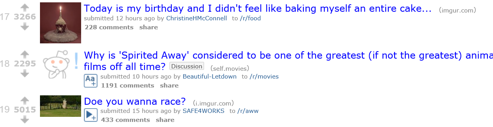

# Reddit

## Description
Build Reddit (bookmarks and voting in ASP.NET MVC using Forms and relationships)

## Objectives

### Learning Objectives

After completing this assignment, you should…

* Be able to utilize Forms in MVC
* Be able to add custom routes to your resources
* Be able to use migrations to update a database

### Performance Objectives

After completing this assignment, you be able to effectively use

* Modeling Data
* Publishing on Azure

## Details

### Deliverables

* A mvc app repo with:
  * asp.net mvc 4.5.2
  * functional migrations
* A link to a live azure instance

### Requirements

* Reddit is "User-generated news links. Votes promote stories to the front
  page."
* Each Link should have a "number of positive votes" column
* The homepage should order by the most number of votes
* Clicking on a link should increment positive vote

## Normal Mode
Normal mode is a simple, naive, implementation of Redit

            
## Hard Mode

* Clicking "DOWN" should create a negative vote
* Add a `User` who `HasManyLinks`
* When submitting a link, allow user to select themselves in a drop down
* Check the Links for unique URLs (i.e. don't allow double posting)

## Nightmare Mode

* Make the user sign in using the 'individual accounts` option when creating your project
* Add Controller testing and Acceptance testing to verify a user clicking a link
  creates the votes you expect

## Notes

* [Azure](http://www.windowsazure.com)

## Additional Resources

* Read [Getting Started with MVC](http://www.asp.net/mvc/overview/getting-started/introduction/getting-started)
* Read [Getting Started with Azure](http://azure.microsoft.com/en-us/get-started/)
* Read [Getting Started with EF6 and MVC 5](https://www.asp.net/mvc/overview/getting-started/getting-started-with-ef-using-mvc/creating-an-entity-framework-data-model-for-an-asp-net-mvc-application)
